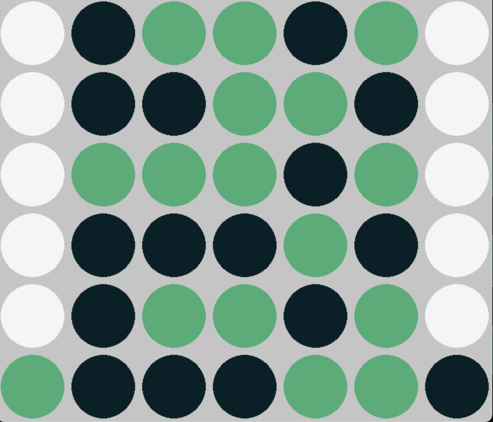

# Connect4-MCTS

We have developed an intelligent Monte Carlo Tree Search (MCTS) algorithm tailored for the classic game Connect 4. In Connect 4, players strategically drop colored tokens into a six-row, seven-column grid, aiming to be the first to form a line of four tokens either horizontally, vertically, or diagonally.

Our algorithm is designed to play strategically when controlling the blue circles, competing against an opponent making random moves. The scoring system assigns a reward of 1 for a win, -1 for a loss, and 0 for a draw.

Notably, the game doesn't start from an empty board but from the specific configuration below. This unique starting point reduces the number of states and accelerates the convergence of the algorithm.



Additionally, we acknowledge the usage of a portion of the game board code from the repository at https://github.com/mukeshmk/connect-4.git.

## Quick started

- To get started:

  ```
  git clone https://github.com/Eloise2000/Connect4-MCTS.git
  cd Connect4-MCTS/
  ```

- To execute the connect-4:

  `python game.py`

## Repository Structure
This is the root directory of the repository. The directory is structured as follows:

    Connect4-MCTS
     .
     |
     |--- board/                           Module utilizes the Pygame library to define and visually represent a Connect 4 game board.
     |
     |--- bots/                            Module defining both a Monte Carlo bot and a random bot for gameplay strategy
     |
     |--- analysis/                        Verification of convergence and the effectiveness of the Upper Confidence Bound for Trees (UCT) in algorithm.
     |
     |--- example/                         An illustrative demonstration and accompanying video showcasing the algorithm in action. 
  